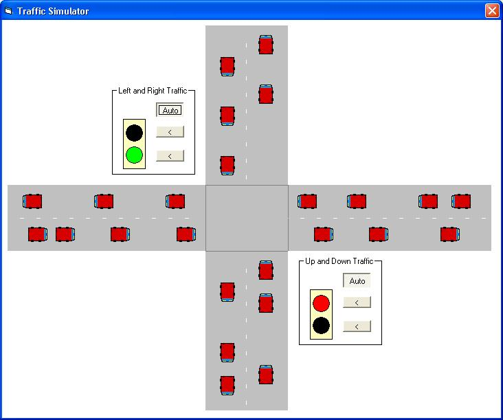



## Traffic Simulator Game

### Description

Traffic Simulator simulates a road environment with cars at a 4-way intersection with working traffic lights.
 
### More Info
 

             |
---                |---
**Submitted On**   |2003-06-15 20:39:30
**By**             |[Adam Szabo](https://github.com/Planet-Source-Code/PSCIndex/blob/master/ByAuthor/adam-szabo.md)
**Level**          |Intermediate
**User Rating**    |5.0 (45 globes from 9 users)
**Compatibility**  |VB 5\.0, VB 6\.0
**Category**       |[Games](https://github.com/Planet-Source-Code/PSCIndex/blob/master/ByCategory/games__1-38.md)
**World**          |[Visual Basic](https://github.com/Planet-Source-Code/PSCIndex/blob/master/ByWorld/visual-basic.md)
**Archive File**   |[Traffic\_Si1601336152003\.zip](https://github.com/Planet-Source-Code/adam-szabo-traffic-simulator-game__1-46204/archive/master.zip)

